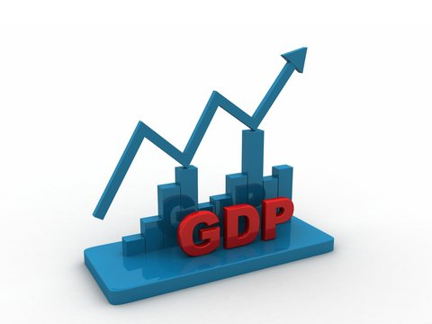

# Fikri Abdillah | Data Science Portfolio

Hi
I'am Fikri. Physics graduate of Institut Teknologi Kalimantan. This portfolio is compilance of my data science and data analyst project I have done for self-learing, hobby, and curiousity purposes. This also contains my archievements, skills, and certificates. It is on updated on the regular basis

- **Email**: fikriabdillah1998@gmail.com
- **LinkedIn**: [Fikri Abdillah](https://www.linkedin.com/in/fikri-abdillah-833b0b245/
)
- **HackerRank**: [Fikri Abdillah](https://www.hackerrank.com/profile/fikriabdillah191)

## Published Paper

- [Quantum-Mechanical Brayton Engine based on a Boson Particle Inside Cubic Potential](https://iopscience.iop.org/article/10.1088/1742-6596/1726/1/012004)
- [Quantum-Mechanical Brayton Engine for the Nonrelativistic Particle Trapped in a Symmetric Potential Box](https://jurnal.untan.ac.id/index.php/jpositron/article/view/40832)
- [Quantum Brayton engine based on a single particle in the 2D symmetric potential well](https://pubs.aip.org/aip/acp/article/2234/1/040007/605190/Quantum-Brayton-engine-based-on-a-single-particle)

## Projects

 **[House Price Prediction](https://github.com/FikriAbdillah01/house-price-prediction)**

A data-driven exploration of how property features shape market value. This project aims to predict house prices using regression models trained on structured housing data. It covers data cleaning, feature engineering, data exploration, and model comparison (Random Forest, XGBoost), with a focus on clarity and tranparency.

#

**[Credit Card Fraud Detection](https://github.com/FikriAbdillah01/credit-card-fraud-analysis)**

The objective in this project is build a model that can detect fraud on the credit card transaction. The dataset consist a 48 hours transaction with more than 20 columns. This project demonstrate the influence of the three preprocessing method such as raw, Imputation, and Isolation Forest on the accuracy of fraud detection.

#

**[Wine Quality Detection](https://github.com/FikriAbdillah01/wine_analysis.git)**

Wine is a fermented grape drink. This project uses data sourced from the UCL repository. As the title suggests, the goal is to explore wine composition and predict its quality using a machine learning model. I've also created a [note]() containing an in-depth discussion of wine composition. I applied the ROC AUC curve to see the classification performance of machine learning.

 

## On Going Projects

**[Churn Analysis](https://github.com/FikriAbdillah01/customer-churn.git)**

Churn is a phenomenon or event where customers decide to leave a company's services. This is common in telecommunications or technology companies that provide services. Churn analysis can help us identify patterns and factors that lead to customer churn. In this project, we will explore customer behaviour dataset. I also applied machine learning models to predict churn.

#

**[AI Chatbot Sentiment Analysis in Google Play](https://github.com/FikriAbdillah01/ai-sentiment-analysis.git)**

In this project, I analyzed the sentiment of an AI chatbot available on Google Play using over 10,000 data sets scraped using the google play scraper. This project included several preprocessing steps such as text cleaning, stopword removal, tokenization, data exploration, and applied sentiment analysis methods such as lexicon-based analysis and TextBlob.

#

**[Gross Domestic Product Prediction](https://github.com/FikriAbdillah01/gdp-prediction)**

The goal of this project is to create a GDP prediction that robust to some macroeconomic events. The data source from the Federal Reserve Economic Data (FRED) is retrieved using the API. This project utilizes several regression models, e.g. simple linear regression and regularized linear regression, with the data divided into several year groups to obtain the smallest prediction error score.
 

## Micro Projects
###  Applied Statistics and Machine Learning Model
- [Weighted Average Ensemble](): Applied two machine learning models then combined.
- [Priciple Component Analysis](): Apply PCA in breast cancer analysis
- [Oversampling Method](): This method applied when there is an oversampling data. For instance credit card fraud.
- [ROC AUC Curve](): This method is useful when 

### Challenges
- [SQL Challenge Danny Dinner](https://github.com/FikriAbdillah01/datascience-portfolio/tree/5c4045146d7c76ce957219c5dabb9b7449cde36a/SQL/Dannys%20Dinner%20problems)
- [SQL Challenge Pizza Runner](https://github.com/FikriAbdillah01/datascience-portfolio/tree/5c4045146d7c76ce957219c5dabb9b7449cde36a/SQL/Pizza%20Runner%20Problem)
-

## Core Competencies

- **Methodologies**: Machine Learning, Time series analysis, Statistics, A/B Testing, Big Data Analytics, Natural Languange Processing.

- **Tools**: BigQuery, MySQL, MS Excel, Google Colab, StreamLit, Docker, Looker, Git, GitHub.

- **Languages**: Python, SQL

## Certificate

### Data Science Certificate

- [Intermediate Machine Learning by Kaggle](certificate/Fikri%20Abdillah%20-%20Intermediate%20Machine%20Learning.png)

- [Introduction to SQL by Kaggle](certificate/Fikri%20Abdillah%20-%20Intro%20to%20SQL.png)

- [Introduction to Machine Learning](certificate/Fikri%20Abdillah%20-%20Intro%20to%20Machine%20Learning%20(1).png)

- [Data Wragling by DQLab](certificate/certificate-DQLABDTWP1UAUDBS.pdf)

- [Machine Learning with Python for Beginner by DQLab](certificate/certificate-DQLABDVIZ2JEWCRW.pdf)

- [Python for Data Professional Beginner by DQLab](certificate/certificate-DQLABINTP1EJGMHD.pdf)

- [Python Fundamental for Data Science by DQLab](certificate/certificate-DQLABINTP1EWSOAA.pdf)

- [Introduction to Data Science with Python by DQLab](certificate/certificate-DQLABINTP1OLAMUH.pdf)

- [Exploratory Data Analysis with Python for Beginner by DQlab](certificate/certificate-DQLABINTP1RTALEG.pdf)

- [Fundamental SQL with SELECT Statement](certificate/certificate-DQLABSQLT1JMUBCP.pdf)

- [Introduction to Deep Learning by Kaggle](certificate/Fikri%20Abdillah%20-%20Intro%20to%20Deep%20Learning.png)

### Physics Certificate

- [International Conference of Condensed Matter Physics in Malang University]()
- [International Conference of Theoretical Physiscs in Malang Universtiy]()
- [Remote Experience for Young Engineers and Scientist]()
- [BICAME]()