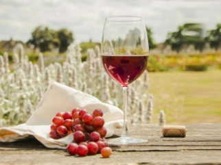
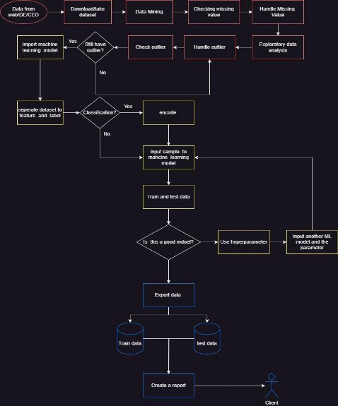
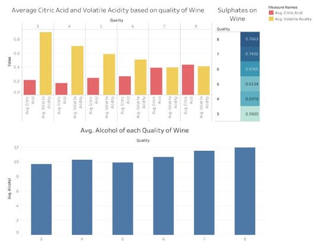
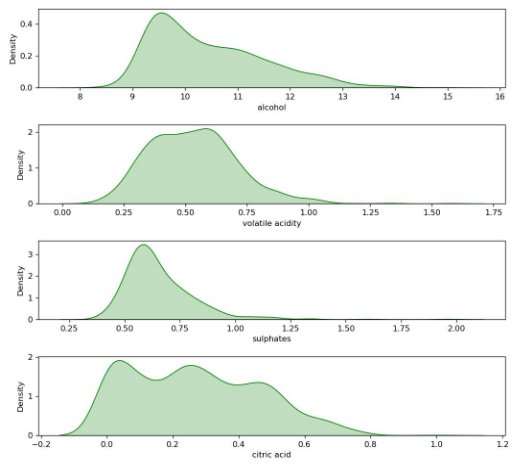
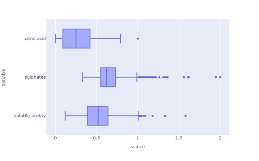
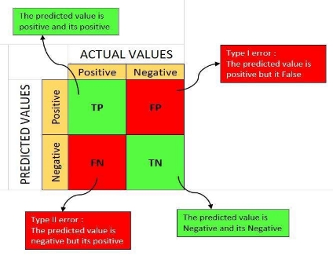
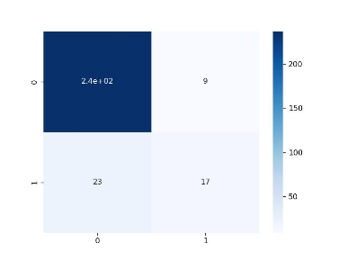
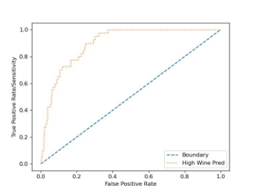



WINE ANALYSIS REPORT 

Dummy Project 

ABSTRACT 

This is a data science dummy project of wine 

prediction.  This  analysis  uses  several classification  models  such  as  Logistic Regression,  Decision  Tree  Classifier,  and Random  Forest  Classifier.  Hasil  dari  analisis adalah ada 4 fitur yang menentukan kualitas wine. 

HP 

[Course title] 

Wine Analysis Report 

1. **Introduction** 

Wine is the fermented juices of the grape and become the luxury symbol for mid-to-high class, especially for wine collector. Wine is not only drinkable, but also became one of many ingredients for cook. According to[ Forbes,](https://www.forbes.com/sites/lizthach/2023/04/20/wine-exports-break-world-record-in-2022/?sh=258b7709451f) Italy be the most wine exporting countries and U.S. is the most wine consumers in 2022. Althought still in covid pandemic era, Italy shiped about 20 million hectolitre of wine of the beverage, followed by Spain and France. The overall production this year is nearly 260 milllion hectoliters. From this data, we can conclude that there is a lot of big fan of wine around the world and this post-fermented product is one of the daily needs either for cook or drink. 

However, according to various websites like New York Times and Bordeaux Science Agro, Institute of Agricultural Science, climate change is one of the plenty of challenges in the future. Wine is the most sensitive and nuanced of agricultural product. Around the wine-producer world, have to contemplated and experimented with adaptations, not only hotter summer, but also colder winters, drought and the sort unexpected, sometimes violent event that stem of climate change: hailstorm, flooding, forest fires, and many more. And more disruptions are coming, much faster than anybody expected. The accelerating effects of climate change are forcing the wine industry, especially those who see wine as an agricultural product rather than an industrial beverage, to take decisive steps to counter or adapt to the shift.  

Based on the report of International Organization of Vine and Wine (OIV), in the European Union (EU), luckilly there is an increase of 2 points in 2022 from the previous year due to rare disease and rain in many areas. However, *stakeholders* still worried of the climate change influence, such as extreme heat and lack of rainfall. The 2017 was the worst year for the winemaking industry. Wine production has fallen dramatically from previous years due to extreme weather, from drought to frost, in many areas. With the appearance climate change, stakeholders are starting to be pessimistic about wine production in the future. As a data scientists/data analysts, we are given the task of how to maintain the quality of wine in times of climate change and maximize the benefits of existing wine production. 

Figure 1.1 Grafik produksi wine setiap tahun 

2. **Methodology** 

The source of the data entirely from[ UC Machine Learning Dataset.](https://archive.ics.uci.edu/dataset/186/wine+quality) This csv data uploaded by  Cortez  from  University  of  California  Davis  and  contain  several  variables  of physicochemical of wine. 

Table 2. 1 Physicochemical of Wine 

|NO |Features |
| - | - |
|1 |Fixed acidity |
|2 |Volatile acidity |
|3 |Citric acid |
|4 |Residual sugar |
|5 |Chlorides  |
|6 |Free sulfur dioxide |
|7 |Density |
|8 |pH |
|9 |Sulphates |
|10 |alcohol |

There are 10 features and quality as a label (target). The workflow of this project represented by Figure 2.1. After upload the data from the source, we do the data mining to check: 

1. Mean, Median, Mode (3M) 
1. Maximum and Minimum value each feature 
1. Interval feature-feature and feature-label data value 
1. Null data, and 
5. Duplicate value 

We handle the missing value or duplicated value first by using imputation method or delete it if just a small number of it. In Exploratory Data Analysis (EDA) step, we visualize some graphs and statistics like p-value and correlation by using Pearson Correlation in order to get information about correlation between feature and label. Outlier can be seen by using Normal (Gaussian) Distribution or boxplot. Outlier deletion depends on the number of data and type of the outlier. In this case, we do not delete it because the given dataset only has small number of data. 

After handle the outlier, import some models. In this project, machine learning model that will be used is logistic regression and linear regression, since this dataset allow us use two models. After import these models, separate dataset into feature and label. If the machine learning model is classification, a few of adjustment is needed for both datasets. Then, input the  samples  into  the  decided  model  (either  classification  or  regression).  Model  need  to evaluated in order to know that this is a good model or not. The model can be said to be good if when making predictions there is no overfitted or underfitted. If this happens, then use hyperparameters to determine the best model and parameters. After the model is determined, model testing is carried out again. If the model has been evaluated and ends with no overfit and underfit, the next step is to save the dataset into a train and test dataset in csv form. The final stage is reporting to stakeholders in the form of an analysis report. 

Figure 2. 1 Flowchart of the project 

3. **Result** 

After doing data mining, there are no null data and duplicated data in the feature, and also the results of this process can be seen in Table 3.1. If you look closely, none of the features have a long range of values other than 'total sulfur dioxide'. The distance between these feature values is very large (can be seen from Min and Max) from other features (features) and labels (feature-labels), so it needs to be rescaled to avoid overfits or underfits during training and testing of machine learning models. On the other hand,  chlorides  is also undervalued, but you don't need to change this as this data source doesn't specify what units of 'chlorides' are and which types of wine have this amount. Therefore, I will not change it, unless there is a special calculation method in research related to wine. After doing data mining and checking for null and duplicate values, we move on to the exploratory data analysis stage. At this stage, we look at the Pearson Correlation, outliers, distribution and some graphs such as barplots. 

Table 3. 1 Data Mining Result 

|**Features** |**count** |**mean** |**std** |**min** |**25%** |**50%** |**75%** |**max** |||||||||||||||||||
| - | - | - | - | - | - | - | - | - | :- | :- | :- | :- | :- | :- | :- | :- | :- | :- | :- | :- | :- | :- | :- | :- | :- | :- |
||fixed acidity |||1143 |||8\.31 |||1\.75 |||4\.6 |||7\.1 |||7\.9 |||9\.1 |||15\.9 ||
||volatile acidity |||1143 |||0\.53 |||0\.18 |||0\.1|` `2||0\.39|3 ||0\.52 |||0\.64 |||1\.58 ||
||citric acid |||1143 |||0\.27 |||0\.2 |||0 |||0\.09 |||0\.25 |||0\.42 |||1 ||
||residual sugar |||1143 |||2\.53 |||1\.36 |||0\.9 |||1\.9 |||2\.2 |||2\.6 |||15\.5 ||
||chlorides |||1143 |||0\.09 |||0\.05 |||0\.0|` `1||0\.07 |||0\.079 |||0\.09 |||0\.611 ||
||free sulfur dioxide |||1143 |||15\.62|||10\.2|` `5||1 |||7 |||13 |||21 |||68 ||
||total sulfur dioxide |||1143 |||45\.91|||32\.7|` `8||6 |||21 |||37 |||61 |||289 ||
||density |||1143 |||0\.997|||0\.00|` `2||0\.9|` `9||0\.99|6 ||0\.9967|||0\.99|` `8||1\.0037||
||pH |||1143 |||3\.311|||0\.15|` `7||2\.7|` `4||3\.20|5 ||3\.31 |||3\.4 |||4\.01 ||
||sulphates |||1143 |||0\.658|||0\.17 |||0\.3|` `3||0\.55 |||0\.62 |||0\.73 |||2 ||
||alcohol |||1143 |||10\.44|||1\.08|` `2||8\.4 |||9\.5 |||10\.2 |||11\.1 |||14\.9 ||
||quality |||1143 |||5\.657|||0\.80|` `6||3 |||5 |||6 |||6 |||8 ||
||Id |||1143 |||805 |||464 |||0 |||411 |||794 |||1210|||1597 ||

The ‘Id’ feature is not give an information, so we decided to drop it. At exploratory data analysis process, we are using the Pearson Correlation method to know which psychochemical had significant impact to the quality of wine. The result in order of this method is: 

1. Alcohol  
1. Volatile acidity 
1. Sulphates 
1. Citric Acid 

The  rest  of  the  psychochemical  is  not  as  significant  as  these.  Every  wine  always has alcohol in it due to fermentation process. Surprisingly, the level of this physiochemical depends on amount of sugar of the grape at harvest time. The yeast consumes the sugar and convert it into alcohol during fermentation. Alcohol is the highest influence to the quality of wine among all psychochemical features. 

Volatile acidity (VA) is a measure of the wine's volatile (or gaseous) acids. Acetic acid is primary volatile acid in wine and also primary acid associated with the smell and taste of vinegar. On the Figure 3.1, This acidity decreases as the quality of the wine increases. This indicates that the less acetic acid in the wine, the better the quality of the wine.  

Wine is the product of fermentation using grape and yeast. One of results of the fermented using yeast is sulphate (sulfit). Almost all of the wine have this chemical product. Winemaker have been adding sulphur dioxide (sulphates) since the 1800s. Sulfur dioxide added in order to protect wine against oxidation, which can affect the color and taste of wine. 

Citric acid is an acid that is usually added as an acid supplement during the fermentation process to help winemakers increase the acidity of wine, especially grapes grown in warmer climates. This acid is a weak organic acid, which is often used as a natural preservative. Citric acid acts as an antimicrobial to prevent the growth of bacteria and fungi. When viewed from the Pearson Correlation, the correlation value with 'quality' is quite high when compared to other features outside the top 4. This indicates that this feature has a significant influence on the quality of the wine. We can see the average content of alcohol, volatile acidity, sulphates, and citric acid. 

Figure 3. 1 The barplot of the most influence feature 

The Figure 3.1 shows a Gaussian distribution of a few of features. If you look at the figure, it  can  be  seen  that  the  feature  'alcohol',  one  of  the  features  of  the  wine  dataset,  has  an asymmetrical Gaussian distribution when compared to 'residual sugar' and 'citric acid'. This indicates that the distribution of data on these features is uneven. The distribution of data can also influence machine learning models. For example, the 'alcohol' graph is skewed to the left, indicating that small values occur more frequently than large ones, resulting in predictions from the machine learning model being more accurate on those values for that feature than vice versa. Skewness is a measurement to find out the symmetry of the Gaussian distribution in data. This measurement is also useful for knowing outliers in the data. However, the number of data outliers cannot be known. Therefore, one way to find out the number is to use the quantile method with a boxplot as a visualization. 

Figure 3. 2. Distribution of wine’s feature 

Outliers are data points that are far from the average observation data. This anomaly is found in every processed data. We have seen the distribution of data on several features, one of which is the 'alcohol' feature, which has an asymmetrical distribution. This indicates the presence of outliers. In order to find out the outliers contained in each feature, one of the methods used is quartile. Quartile is a term in statistics for dividing data into 3 intervals (quartiles 1, 2 and 3) based on data values. The median or quartile 2 is the reference in this method because it is not affected by extreme values (outliers) in the distribution. 

In Figure 3.3, 'sulphates', one of the features that has a large influence on labels, and some other features have some outliers and this can affect predictions. Therefore, the outliers need to  be removed or replaced with  several  imputation techniques such as imputation  mean, imputed median, or replace them with outlier limits. However, there needs to be consideration before removing outliers, such as outlier categories and the amount of data in the dataset. In this case, I did not delete or change this outlier because the amount of data is small and if it is replaced or deleted, it will also interfere with machine learning predictions. 

Figure 3. 3. Outlier on several influential features 

The machine learning models used in this research are classification and regression. In the classification model, the target/label data needs to be classified into high-quality wines (quality 7 and 8) and low-quality wines (quality below 7). High quality wine is changed to 1 and the rest to 0. Evaluation of the model used is accuracy, precision, ROC, and AUC. Accuracy is how close the prediction is to the actual value, while accuracy is how close the values are in several  trials.  ROC  (Receiver  Operating  Characteristic)  -  AUC  (Area  Under  Curve)  is  a performance measurement for classification problems. ROC is a probability curve (likelihood), while AUC represents the size or degree of separation. If the AUC value is high, then the model is considered good enough in predicting output. 

True Positive (TP) is the result where the model predicts the positive class correctly, while False Negative (FN) is the result where the model predicts a negative value, but the actual value is positive. False Positive (FP) is the result of calculations in predicting a positive value, which is actually a negative value, while True Negative (TN) is the result of correctly predicting a negative value. These four results can be shown with the confusion matrix in Figure 3.4. 

Figure 3. 4 Confusion Matrix 

By knowing TP dan True Positive Rate (TPR/sensitivity) can be calculated by 

- , +

TPR tells us what proportion of positive class got correctly classified. whereas False Positive Rate (FPR) is 

- 1 − = 1 −=

\+ +

which tells us how many negative class got correctly classified The confusion matrix can be seen in Figure 3.5The confusion matrix shows that the Logistic Regression model can correctly predict about 250 samples (True Positive: 242 and True Negative: 17) of wine quality, while there are 32 false predictions (False Positive: 9 and False Negative: 23). Accuracy on this model is 0.89. 

Figure 3. 5. Confusion matrix of Logistic Regression 

`     `These two formulas are important for calculating ROC. ROC is a graph consisting of sensitivity on the y-axis and specificity on the x-axis (see Figure 3.6). The image is a ROC graph from predictions using the machine leaning Logistic Regression classification model. The blue line depicts no difference between positive and negative values in the predicted results of machine learning. If the results of the ROC graph are the same as the diagonal, in this case, it means that the machine learning model cannot distinguish between high and low quality wines. If we look at Figure 3.5, the logistic regression classification model can show quite good performance. This model can distinguish between high quality and low-quality wines well with an AUC (Area Under Curved) score of 0.86. The model will be considered bad if the AUC score is close to 0.5 which indicates that the model cannot distinguish the quality of the wine. 

Although Logistic Regression shows good results, this model is not the best model on wine quality prediction. Therefore, we need to compare it with other classification models such as the Random Forest Classifier, Decision Tree Classifier, Support Vector Machine, and others with the GridSearchCV feature as a hyperparameter.  

Figure 3. 6 ROC Curve of Logistic Regression Model 

4. **Decision Recommendation** 

After processing and analyzing existing data, as a data analyst/data scientist, I recommend improving the quality of wine, winemakers, stakeholders, or the company officials needs to: 

1. Pay attention to the 4 psychochemicals of wine (alcohol, volatile acidity, sulphates and citric acid) as aspects that need to be prioritized in improving the quality of wine. 
1. Reducing  the  quantity  of  high  quality  wine  produced  to  reduce  production  costs. Moreover, if production decreases, the wine will become scarce in the market (or in the auction market), the price will skyrocket. Upper middle class people will be interested in buying the wine. 
1. Increase production of low quality wines. If the amount of wine available is abundant in the market at a relatively affordable price, people of any economic class are interested in buying it, either for drinking or as a cooking ingredient. 
1. It is necessary to have data - such as the price of wine, the amount of production, the type of wine, the origin of production, sales results, the year of production, and so on - obtained from survey results to find out what kind of wine consumers want such as sweet wine, sour wine, wine that is specifically for.  

The roles for data scientist are as follows: 

1\.  Perform feature engineering on data before making predictions with machine learning models. Before doing so, ask an expert or look for references that specifically discuss the quality of the wine, such as what important features are not recorded in the data. 

5. **Conclusion** 

Based on the results of data analysis, alcohol, volatile acidity, sulphates, and citric acid are psychochemicals that have an impact on wine quality using Pearson Correlation. With the confusion matrix, the accuracy of the logistic regression model is 0.89, which means this model is good enough to predict the quality of wine. Moreover, this model can differentiate wine quality as proven by the AUC score of 0.86. 

**Reference** 

- Puckette,  Madeline.  What  is  Residual  Sugar  in  Wine?.  2020. https://winefolly.com/deep-dive/what-is-residual-sugar-in-wine/ 
- Howard,  Cathy.  What  is  Residual  Sugar  in  Wine?.  2015. https://whicherridge.com.au/blog/what-is-residual-sugar-in- wine/#:~:text=The%20residual%20sugar%20remaining%20in,0.3%20to%202%20g% 2FL. 
- Nierman, Doug. Acidity is a fundamental property of wine, imparting sourness and resistance  to  microbial  infection.  2004.  https://waterhouse.ucdavis.edu/whats-in- wine/fixed- acidity#:~:text=The%20predominant%20fixed%20acids%20found,2%2C000%20mg %2FL%20succinic%20acid. 
- Iland, Patrick. Monitoring the Winemaking Process from Grapes to Wine: Techniques and Concepts. 2014 
- Jacobson, Jeal. N, Introduction to Wine Laboratory and Procedures.2016. ISBN:0-387-

24377-1 

 

**Appendix** 
