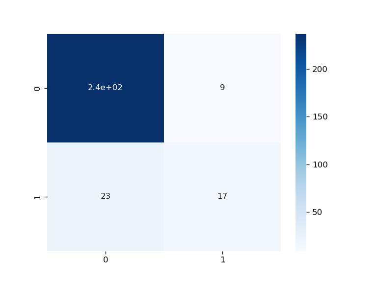

# Wine Quality Analysis


## Table of Content

-[Project Overview](#project-overview)

-[Background](#background)

-[Data Source](#data-sources)

-[Data Description](#data-description)

-[Tools](#tools)

-[Result](#result)

-[Limitation](#limitations)

-[Appendix A: Flowchart](#appendix-a-flowchart)

-[Appendix B: Visualization](#appendix-b-visualization)

---


### Project Overview

This wine data aims to provide business insight to wine company. By analyzing a few of chemical aspects data, we seek to identify trends, and gain deep understanding of the quality of wine.

### Background

The problem of the wine nowadays is:

1. The production rate of wine is not as massive as before and it will continously drop in the future due to several external influence such as climate change and pandemic. 

### Data Sources

Wine Data: The main dataset of this project is 'WineQT.csv', containing chemical information of wine. This data gathered from University of California Irvine (UCl) Machine Learning Repository or Kaggle. 

### Data Description

The data have about 1000 indexes and 10 features. Here we create a table of brief definition of each feature.

|Columns|Description|
|---|---|
|Alcohol|a product of the grape-yeast post-fermentaion. Usually measure in %.|
|Volatile Acidity| a measure of the wine's volatile (or gaseous) acids.|
|Fixed Acidity| Influences the flavor of the wine. A significant reduction in acids can lead to wines that taste flat.|
|Citric Acid| an antimicrobial to prevent the growth of bacteria and fungi.|
|Residual Sugar|The sugar left inside a wine after fermentation.|
|Free Sulfur Dioxide|The amount of sulfur dioxide (SO2) in free form.|
|Total Sulfur Dioxide|The amount of SO2 in total. This chemical added to protect wine against oxidation, which can affect the color and taste of wine.|
|Density|adfa|
|pH|a measure how acid or base the chemical substance.|
|sulphates|a food preservative to maintain the wine flvaorness and freshness.|
|Quality|describe the quality of wine on scale 0 (very poor) to 10 (very good).|

### Tools

The tools were using to analyze is:

- Python (Visualization and create prediction)

### Data Cleaning/Preprocessing

In this step, we performed following task:

1. Data loading
2. Cleaning
3. Handling missing value
4. Encoding (For classification model of machine learning)

### Exploratory Data Analysis (EDA)

Explore the data to answer several key questions, such as:

1. What is the most important psychochemical substance that can determine the high or low quality?

2. What is the correlation between pychochemical substance and the quality of wine?

2. How accurate the machine learning prediction of low and high wine quality?

### Result

The analysis results are summarized as follows:

1. There are 4 psychochemicals that needs to be considered  to make high or low quality wine, which is `alcohol`, `volatile acidity`, `sulphates`, and `citric acid`.

2. `Alcohol`, `citric acid`, and `sulphates` has a positive correlation to the quality of wine, whereas `volatile acidity` has the opposite.

3. The machine learning classification model could distinguish between low and high quality wine with 89% accuracy. 

### Recommendation

Based on an analysis, we recommend that:

1. For wine factory and distributors, the wine quality and target market need to be decided before produce a wine. For instance, Increase production of low quality wines. If the amount of wine available is abundant in the market at a relatively affordable price, people of any economic class are interested in buying it, either for drinking or as a cooking ingredient.

2. `Alcohol`, `sulphate`, and `citric acid` has **positive correlation** to the wine quality. It means that the wine will upgrade if both chemicals added. However, the `volatile acidity` and downgrades the quality. This acid should be distilled out from a wine after fermentation process.  

3. We suggest to add size and some features such as the price of the wine and age of the wine to create more new insight and recommendations. 

### Limitations

There are some limitations of this analysis:

1. The data that we processed is quite small and it makes the accuracy of the prediction is quetionable. The wine expert opinion is needed to create more accurate prediction.

2. There are a few outliers that cannot be dropped due to the smaller of data, the worse the prediction is.

3. The imbalance of wine data creates suboptimal machine learning performance.

### Refrences

- [Puckette,  Madeline.  What  is  Residual  Sugar  in  Wine?.2020.](https://winefolly.com/deep-dive/what-is-residual-sugar-in-wine/)

- [Howard,  Cathy.  What  is  Residual  Sugar  in  Wine?.](https://whicherridge.com.au/blog/what-is-residual-sugar-in-wine/#:~:text=The%20residual%20sugar%20remaining%20in,0.3%20to%202%20g%)

- [Nierman, Doug. Acidity is a fundamental property of wine, imparting sourness and resistance  to  microbial  infection.  2004.](https://waterhouse.ucdavis.edu/whats-in-wine/fixed-acidity#:~:text=The%20predominant%20fixed%20acids%20found,2%2C000%20mg%2FL%20succinic%20acid)

- Iland, Patrick. Monitoring the Winemaking Process from Grapes to Wine: Techniques and Concepts. 2014

- Jacobson, Jeal. N, Introduction to Wine Laboratory and Procedures.2016. ISBN:0-387-24377-1 

- Bartowsky, E.J., Henschke, P.A., “The ‘buttery’ attribute of wine-diacetyl-desirability, spoilage and beyond. 2004. Int. J. of Food Microbiology 96: 235-255.

- Boulton, R.B., Singleton,. V., Bisson, L., and Kunkee, R., Principles and Practices of Winemaking. 1996 Chapman & Hall, New York.

- Lui, S. Q. Malolactic fermentation in wine – beyond deacidification.  2001. Journal of Applied Microbiology 2002, 92, 589–601.

### Appendix A: Flowchart


### Appendix B: Visualization

```python
# Create Correlation using Heatmap
inf_cols = df[['quality', 'alcohol', 'citric acid', 'volatile acidity', 'sulphates']]
cols = inf_cols.corr(method = 'spearman').nlargest(inf_cols.shape[0],'quality')['quality'].index
cm = np.corrcoef(inf_cols[cols].values.T)
fig = plt.figure(figsize=(5,4))
sns.set(font_scale= 0.8)
sns.heatmap(data = cm, cmap = 'RdYlBu', annot=True, fmt = '.2f', xticklabels=cols.values,  yticklabels=cols.values)
fig.tight_layout()
plt.title('Highest correlation of wine quality')
plt.savefig('correlation data', dpi = 300)
```


```python
fig = plt.figure(figsize = (7,7))
sns.countplot(df2, x = df2['quality'])
plt.title('wine quality distribution')
plt.savefig('wine_quality', dpi = 200)
```


```python
# Evaluate Random Forest Classifier Model
from sklearn.metrics import accuracy_score, confusion_matrix, classification_report
def evaluation_score (test_var, prediction = rfc.predict(X_tst_sc)):
    rfc_acc = accuracy_score(test_var, prediction)
    conf_mat = confusion_matrix(test_var, prediction)
    plt.figure(figsize = (4,4))
    sns.heatmap(conf_mat, annot = True)
    print(f'accuracy score of Random Forest Classifier model is {rfc_acc}')
    print(classification_report(test_var, prediction))

evaluation_score()
```


